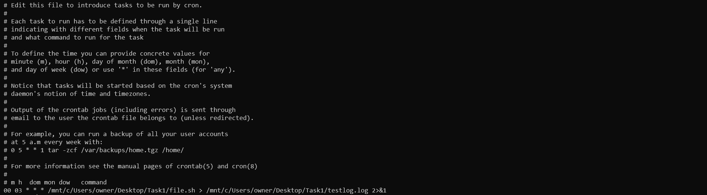

# Steps I have been taken.

## For [openexchange data pull](openexchange_data_pull.py) file

1. I fetched the data from API, using requests library.
2. Set the current date to a variable using datetime library, so everyday when I fetch the new data from the api I will be sure it is for today. The fetched data is json.
3. Created my database(Db) using ElephantSQL.
    - ElephantSQL is PostgreSQL database hosting service.
4. I saved the db host, db name, db user, db password and api key in .env file, and included the .env file to .gitignore file. Using dotenv package. I used it because it makes configuration easier and better security.
5. To connect to the db I used psycopg2.
    - Created the table using create query.
    - After that I am inserting new data to the table.
6. Since it is scheduled to autorun everyday, I followed these steps to do it ..
    - I used crontab.
    
7. In file. sh I wrote some commands, it will enter the environment shell after that it will run openexchange_data_pull file.

## For [report file](report.py) file

1. I am selecting from database(Db), using json queries.
2. Reading the selected data using pandas.
3. Displayed the selected data using matplotlib.pyplot.